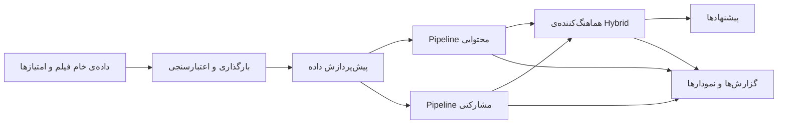
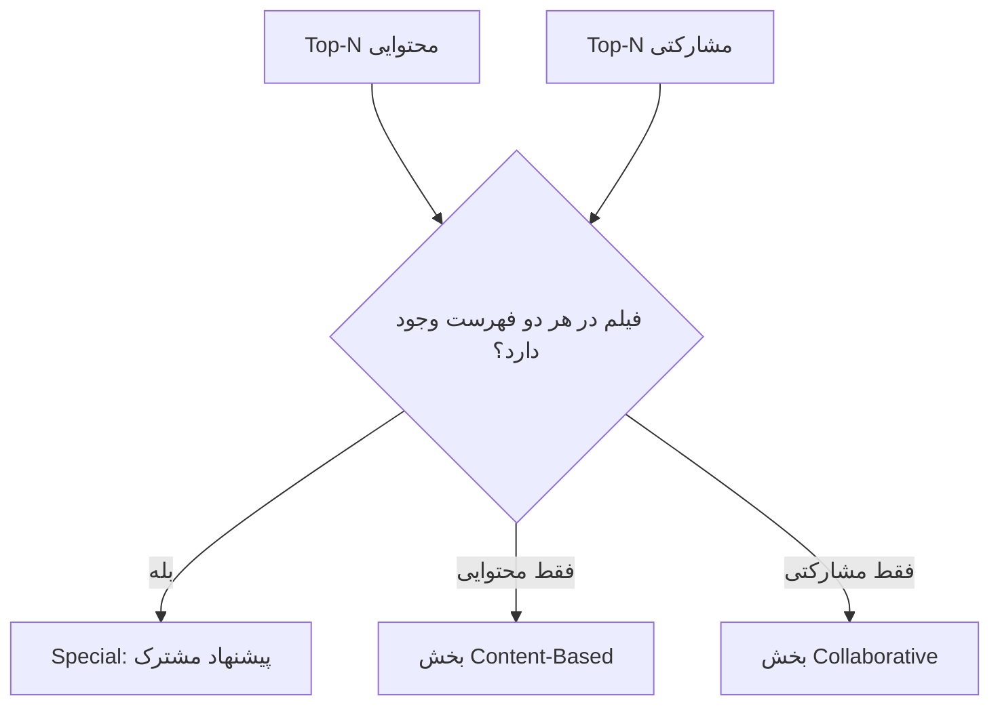

<a id="-راهنمای-فارسی"></a>

## 🇮🇷 راهنمای فارسی

### 🎬 معرفی پروژه

این پروژه، یک سیستم ماژولار برای پیشنهاد فیلم است که با `Python` ساخته شده است. پروژه از سه بخش اصلی تشکیل شده است:

* یک `pipeline` مشترک برای بارگذاری، اعتبارسنجی و آماده‌سازی داده‌ها؛
* یک سیستم پیشنهاددهنده‌ی مبتنی بر محتوا (`Content-Based`) بر اساس ژانر فیلم‌ها؛
* یک سیستم پیشنهاددهنده‌ی مشارکتی (`Collaborative Filtering`) بر پایه‌ی فاکتورگیری ماتریس با الگوریتم `SVD`.

بخش `Hybrid` این دو سیستم پیشنهاددهنده را به‌صورت مستقل اجرا می‌کند و نتایج آن‌ها را در سه گروه قرار می‌دهد: فیلم‌هایی که هر دو مدل پیشنهاد داده‌اند، فیلم‌هایی که فقط مدل `Content-Based` پیشنهاد داده است و فیلم‌هایی که فقط مدل `Collaborative` پیشنهاد داده است.

ساختار پروژه به‌صورت ماژولار طراحی شده است تا هر بخش را بتوان به‌صورت مستقل آزمایش، اصلاح یا جایگزین کرد؛ بدون اینکه لازم باشد کل سیستم از ابتدا بازنویسی شود.

در پیاده‌سازی فعلی، برای پیشنهاددهی مبتنی بر محتوا و پیشنهاددهی `Hybrid` می‌توان یک فیلم یا چند فیلم را به‌عنوان فیلم‌های اولیه انتخاب کرد.

### ✨ این پروژه چه چیزهایی را نشان می‌دهد؟

* جداسازی مناسب مراحل آماده‌سازی داده، مهندسی ویژگی، مدل‌سازی، پیشنهاددهی و ارزیابی؛
* پیشنهاد فیلم بر اساس ویژگی‌های ژانری و شباهت کسینوسی (`Cosine Similarity`)؛
* پیشنهاد فیلم بر اساس سابقه‌ی امتیازدهی کاربران و الگوریتم `SVD`؛
* سازمان‌دهی نتایج `Hybrid` بر اساس میزان اشتراک خروجی دو مدل مستقل؛
* تولید گزارش‌های اعتبارسنجی، گزارش‌های ارزیابی مدل، جدول‌های پیشنهاد و خروجی‌های تصویری؛
* ساختاری قابل توسعه برای اضافه کردن `API`، `Docker` یا رابط کاربری در مراحل بعدی.

### 🧭 معماری کلی سیستم



### 🗂️ داده‌ها و `Pipeline` آماده‌سازی

پروژه از دیتاست `MovieLens` استفاده می‌کند و شامل دو فایل اصلی `CSV` است:

| فایل                     | ستون‌های اصلی                                                                          | کاربرد                           |
| ------------------------ | -------------------------------------------------------------------------------------- | -------------------------------- |
| <code>movies.csv</code>  | <code>movieId</code>، <code>title</code>، <code>genres</code>                          | اطلاعات فیلم و ویژگی‌های محتوایی |
| <code>ratings.csv</code> | <code>userId</code>، <code>movieId</code>، <code>rating</code>، <code>timestamp</code> | سابقه‌ی تعامل کاربران با فیلم‌ها |

فایل‌های خام باید داخل مسیر <code>data/raw/</code> قرار داشته باشند. از آنجا که حجم داده نسبتاً زیاد است، این فایل‌ها در مخزن با استفاده از `Git LFS` مدیریت می‌شوند.

`Pipeline` مشترک داده، مراحل زیر را انجام می‌دهد:

1. فایل‌های خام `CSV` را از یک مسیر و با یک رابط یکسان بارگذاری می‌کند.
2. تعداد سطرها و ستون‌ها، نوع داده‌ها، مقادیر خالی و رکوردهای تکراری را بررسی می‌کند.
3. سال انتشار فیلم را از عنوان آن استخراج می‌کند.
4. عنوان فیلم‌ها را پاک‌سازی می‌کند و مقدار چندبخشی ژانرها را به فهرست تبدیل می‌کند.
5. ستون <code>timestamp</code> را از داده‌های امتیازدهی حذف می‌کند؛ زیرا مدل‌های فعلی هنوز از اطلاعات زمانی استفاده نمی‌کنند.

به این ترتیب، تمام روش‌های پیشنهاددهی از یک پایه‌ی داده‌ی مشترک و آماده‌شده استفاده می‌کنند.

### 🎯 پیشنهاددهی مبتنی بر محتوا

ماژول `Content-Based` فیلم‌هایی را پیشنهاد می‌دهد که از نظر ویژگی‌های محتوایی به یک یا چند فیلم انتخاب‌شده شباهت دارند.

روند کار این ماژول به‌صورت خلاصه به شکل زیر است:

1. فهرست ژانرهای هر فیلم را با استفاده از `One-Hot Encoding` به یک ماتریس عددی تبدیل می‌کند.
2. هر فیلم را به‌صورت یک بردار ژانری نمایش می‌دهد.
3. برای یک فیلم انتخاب‌شده یا میانگین چند فیلم انتخاب‌شده، یک `Profile` ایجاد می‌کند.
4. شباهت کسینوسی (`Cosine Similarity`) بین `Profile` و بردار تمام فیلم‌ها را محاسبه می‌کند.
5. فیلم‌های ورودی را از نتایج حذف می‌کند، نتایج را مرتب می‌کند و `Top-N` پیشنهاد را برمی‌گرداند.

مزیت اصلی این روش، قابل‌توضیح بودن دلیل پیشنهادهاست. یک فیلم پیشنهاد می‌شود چون الگوی ژانری آن به فیلم‌های انتخاب‌شده نزدیک است.

این بخش از سه لایه‌ی اصلی تشکیل شده است:

* مهندسی ویژگی (`Feature Engineering`)؛
* محاسبه‌ی شباهت (`Similarity Calculation`)؛
* پیشنهاددهی (`Recommendation`).

### 👥 پیشنهاددهی مشارکتی

ماژول `Collaborative` به‌جای استفاده از اطلاعات ژانری فیلم‌ها، از رفتار امتیازدهی کاربران یاد می‌گیرد.

در این بخش از الگوریتم `SVD` در کتابخانه‌ی `Surprise` استفاده شده است. این الگوریتم با استفاده از فاکتورگیری ماتریس، روابط پنهان میان کاربران و فیلم‌ها را یاد می‌گیرد.

روند آموزش مدل شامل مراحل زیر است:

1. تبدیل `DataFrame` امتیازها به دیتاست قابل استفاده برای `Surprise`؛
2. تقسیم داده‌ها به مجموعه‌ی آموزش و آزمون؛
3. آموزش مدل `SVD` با پارامترهایی مانند تعداد فاکتورهای نهفته، نرخ یادگیری، `Regularization` و تعداد `Epoch`؛
4. ارزیابی عملکرد مدل در پیش‌بینی امتیازها با معیارهای `RMSE` و `MAE`؛
5. پیش‌بینی امتیاز فیلم‌های مناسب و برگرداندن فیلم‌های دیده‌نشده‌ی کاربر با بالاترین امتیاز پیش‌بینی‌شده.

مدل آموزش‌دیده و `Trainset` آن با استفاده از `Joblib` ذخیره می‌شوند تا در اجراهای بعدی، نیازی به آموزش مجدد مدل نباشد.

### 🔀 پیشنهاددهی `Hybrid`

بخش `Hybrid` در این پروژه یک لایه‌ی هماهنگ‌کننده است و یک مدل `Weighted Score Fusion` محسوب نمی‌شود.

ابتدا دو سیستم پیشنهاددهنده به‌صورت مستقل اجرا می‌شوند و سپس نتایج آن‌ها در کنار یکدیگر سازمان‌دهی می‌شوند.



فرآیند `Hybrid` شامل ویژگی‌های زیر است:

* فیلم‌هایی را که کاربر قبلاً مشاهده یا امتیازدهی کرده است از نتایج حذف می‌کند؛
* فیلم‌های مشترک میان دو مدل را در بخش <code>special</code> قرار می‌دهد؛
* فیلم‌های پیشنهادشده فقط توسط مدل `Content-Based` و فقط توسط مدل `Collaborative` را در بخش‌های جداگانه نگه می‌دارد؛
* امتیاز و رتبه‌ی تولیدشده توسط هر مدل را حفظ می‌کند؛
* مجموع رتبه‌های دو مدل را فقط برای مرتب‌سازی بخش مشترک <code>special</code> استفاده می‌کند و امتیازهای دو مدل را مستقیماً با یکدیگر ترکیب نمی‌کند؛
* صحت داده‌های ورودی، ستون‌های خروجی، شناسه‌های تکراری، کامل بودن `Metadata`، میزان اشتراک نتایج، تنوع ژانرها و خلاصه‌ی امتیازها را بررسی می‌کند.

`Pipeline` فعلی `Hybrid` می‌تواند چند عنوان فیلم اولیه را دریافت کند، شناسه‌ی آن‌ها را پیدا کند و این شناسه‌ها را برای ساخت `Profile` محتوایی به ماژول `Content-Based` ارسال کند.

### 🧱 ساختار پروژه

```text
hybrid-recommendation-system/
├── data/
│   ├── raw/                      # فایل‌های خام فیلم‌ها و امتیازها
│   └── processed/                # مسیر آماده برای داده‌های پردازش‌شده‌ی آینده
├── docs/                         # مستندات هر ماژول
├── outputs/
│   ├── dataset_analysis/         # گزارش‌های بررسی و آماده‌سازی داده
│   ├── content_based/            # خروجی‌های اجرای Content-Based
│   ├── collaborative/            # خروجی‌ها و مدل‌های Collaborative
│   ├── hybrid/                   # خروجی‌های اجرای Hybrid
│   └── showcase/                 # گزارش‌ها، Artifactها و خروجی‌های نمایشی
├── scripts/
│   ├── dataset/                  # تحلیل، اعتبارسنجی و پیش‌پردازش داده
│   ├── content_based/            # اجرای Feature، شباهت و پیشنهاددهی
│   ├── collaborative/            # آموزش SVD و پیشنهاددهی
│   └── hybrid/                   # تولید و ارزیابی خروجی Hybrid
├── src/
│   ├── config/                   # مسیرهای مرکزی پروژه
│   ├── data/                     # بارگذاری، اعتبارسنجی و پیش‌پردازش
│   ├── content_based/            # ویژگی‌های ژانری و Cosine Similarity
│   ├── collaborative/            # مدل SVD، ارزیابی و پیشنهاددهی
│   └── hybrid/                   # هماهنگی و ارزیابی Hybrid
├── requirements.txt
├── pyproject.toml
└── LICENSE
```

### 🚀 نصب و راه‌اندازی

دستورهای زیر را از ریشه‌ی مخزن اجرا کنید:

```bash
python -m venv .venv
```

در `Windows PowerShell`:

```powershell
.venv\Scripts\Activate.ps1
```

در `macOS/Linux`:

```bash
source .venv/bin/activate
```

سپس وابستگی‌های پروژه را نصب کنید:

```bash
python -m pip install -r requirements.txt
```

اگر بعد از `Clone` فایل‌های داده به‌طور کامل دریافت نشدند، مطمئن شوید `Git LFS` نصب شده است و سپس داده‌های تحت مدیریت آن را دریافت کنید:

```bash
git lfs install
git lfs pull
```

### ▶️ اجرای `Pipeline`ها

تمام دستورهای زیر باید از ریشه‌ی پروژه اجرا شوند.

#### ۱. بررسی و آماده‌سازی داده‌ها

```bash
python scripts/dataset/analyze_dataset.py
python scripts/dataset/validate_dataset.py
python scripts/dataset/preprocess_dataset.py
```

#### ۲. اجرای `Pipeline` محتوایی

```bash
python scripts/content_based/run_feature_engineering.py
python scripts/content_based/run_similarity.py
python scripts/content_based/run_recommender.py
```

برای یک بررسی ساده با چند عنوان فیلم انتخابی:

```bash
python scripts/content_based/test_content_based.py
```

#### ۳. آموزش و استفاده از مدل مشارکتی

برای آموزش، ارزیابی، ذخیره‌ی مدل و تولید یک نمونه پیشنهاد:

```bash
python scripts/collaborative/run_svd.py
```

پس از ایجاد `Artifact`های مدل، اسکریپت آزمایشی مدل را بارگذاری می‌کند و شناسه‌ی کاربر را از شما دریافت می‌کند:

```bash
python scripts/collaborative/test_collaborative.py
```

#### ۴. اجرای `Pipeline` Hybrid

```bash
python scripts/hybrid/run_hybrid.py
```

این `Pipeline` ابتدا بخش `Collaborative` را آموزش می‌دهد، ماتریس ژانری را ایجاد می‌کند، فهرست پیشنهادهای هر دو مدل را تولید می‌کند و سپس خروجی را به سه بخش تقسیم می‌کند:

* پیشنهادهای مشترک؛
* پیشنهادهای فقط محتوایی؛
* پیشنهادهای فقط مشارکتی.

برای ارزیابی خروجی تولیدشده، می‌توانید ماژول ارزیابی فعلی را اجرا کنید:

```bash
python src/hybrid/evaluate_hybrid.py
```

شناسه‌ی کاربر، عنوان فیلم‌های اولیه و تعداد پیشنهادهای موردنظر در اسکریپت‌های مربوطه تنظیم شده‌اند و می‌توان آن‌ها را بدون تغییر در کلاس‌های اصلی پروژه ویرایش کرد.

### 📦 خروجی‌ها و `Showcase`

خروجی‌های زمان اجرا در پوشه‌ی <code>outputs/</code> و بر اساس `Pipeline` مربوطه دسته‌بندی می‌شوند.

بسته به ماژول، این خروجی‌ها می‌توانند شامل موارد زیر باشند:

* جدول‌های پیشنهاد؛
* گزارش‌های ارزیابی؛
* `Feature Artifact`ها؛
* داده‌های ذخیره‌شده‌ی مدل؛
* نمودارها و خروجی‌های تصویری.

پوشه‌ی <code>outputs/showcase/</code> نمونه‌های مرتب‌شده و قابل نمایش از بخش‌های تحلیل داده، `Content-Based` و `Collaborative` را نگه می‌دارد.

هر بخش به‌صورت جداگانه نگهداری می‌شود تا نتایج مراحل مختلف با یکدیگر混 نشوند و بررسی خروجی هر مرحله ساده‌تر باشد. فایل‌های مربوط به مدل و نمونه‌های تولیدشده نیز بر اساس ماژول مربوطه دسته‌بندی شده‌اند.

در حال حاضر، خروجی‌های `Hybrid` هنوز در `Showcase` قرار نگرفته‌اند. با اجرای `Pipeline`، این خروجی‌ها در <code>outputs/hybrid/</code> ایجاد می‌شوند و پس از نهایی شدن نحوه‌ی نمایش آن‌ها، می‌توان آن‌ها را به `Showcase` اضافه کرد.

### 📚 مستندات تکمیلی

* [مستندات `Pipeline` داده](docs/dataset.md)
* [مستندات پیشنهاددهی مبتنی بر محتوا](docs/content_based.md)
* [مستندات `Collaborative Filtering`](docs/collaborative.md)

### 🛠️ فناوری‌های استفاده‌شده

* `Python`
* `Pandas` و `NumPy` برای پردازش داده‌ها؛
* `Scikit-learn` برای محاسبه‌ی `Cosine Similarity`؛
* `Scikit-surprise` برای فاکتورگیری ماتریس با `SVD`؛
* `Joblib` برای ذخیره و بارگذاری `Model Artifact`ها؛
* `Matplotlib` و `Seaborn` برای تولید و پشتیبانی از خروجی‌های تصویری.

### 🔮 مسیر توسعه‌ی آینده

ساختار پروژه به‌گونه‌ای طراحی شده است که قابلیت‌های جدید بتوانند بدون تغییر در ایده‌ی اصلی سیستم به آن اضافه شوند.

مسیرهای توسعه‌ی آینده شامل موارد زیر هستند:

* آماده‌سازی اجرای قابل تکرار (`Reproducible`) با `Docker`؛
* ارائه‌ی سرویس پیشنهاددهی از طریق `API`؛
* ساخت یک رابط کاربری یا `Application` سبک؛
* استفاده از ویژگی‌های غنی‌تر فیلم‌ها و روش‌های پیشرفته‌تر رتبه‌بندی؛
* بهبود ثبت آزمایش‌ها و ارزیابی‌های مناسب برای محیط `Deployment`.

### 📄 مجوز

این پروژه تحت مجوز `MIT` منتشر شده است. برای مشاهده‌ی جزئیات، به فایل [LICENSE](LICENSE) مراجعه کنید.

[⬆️ بازگشت به انتخاب زبان](#hybrid-recommendation-system)
